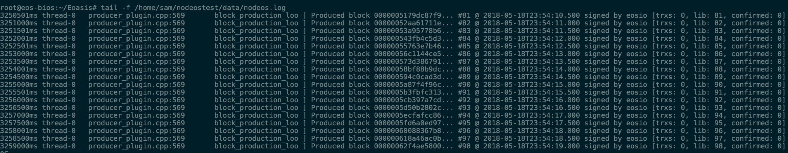

# Eoasis
**Infrastructure of blockchain.Now we just support _EOS_.**

# Example Instance
## Here we run 30 containers as block producers

Host | Type | Ipaddress | Port|
-----|-------|----|----|
eos0| BIOS |103.235.232.27| 9876
eos1| BP Host| 103.235.232.21| 9700~9714
eos2| BP Host | 103.235.232.43| 9700~9714

# EOS BIOS Node
*You need configure the "datadir" and "configdir" in config.ini* before execute below steps.

```
python setp2paddress.py
python main.py startbios
python main.py createwallet
python main.py importbiosprivatekey
```

You can check the output of nodeos like this:



# Block Producer Node

```
python setp2paddress.py
python main.py startnode
python main.py createwallet
python main.py importbpprivatekey

```
For our example instance, we have a agent.sh

```
./agent.sh 15
```

It will generate the hostname in a random way. Also producer name is the container hostname.

*The output like this:*


**Remeber: bios contract,token contract and system contract must been deplied into bios node**
# BIOS Contract
```
python main.py setbioscontract
```


# Create BIOS Stage's Block producers
You should copy **"accounts.conf"**  to biosnode's **"accounts.conf"** for these following steps

```
python main.py createbpaccount
python main.py setprods
```


# Token Contract

```
python main.py settokencontract
python main.py createtoken
python main.py issuetoken
```
# System Contract

```
# python main.py setsystemcontract
```

# Register Block Producer

*On BP host*

```
./regproducer.sh

```


# Voting Process

```
# ./createvoter.sh
# python createvoterbysystem.py
# python main.py createaccountbysystem
# python transfer.py
# python main.py currencytransfer
# python delegateandvoter.py
# python voter.py
```


***Now, You can have a check that the bp as your voting. Sorry for the only voter in this example instance***
